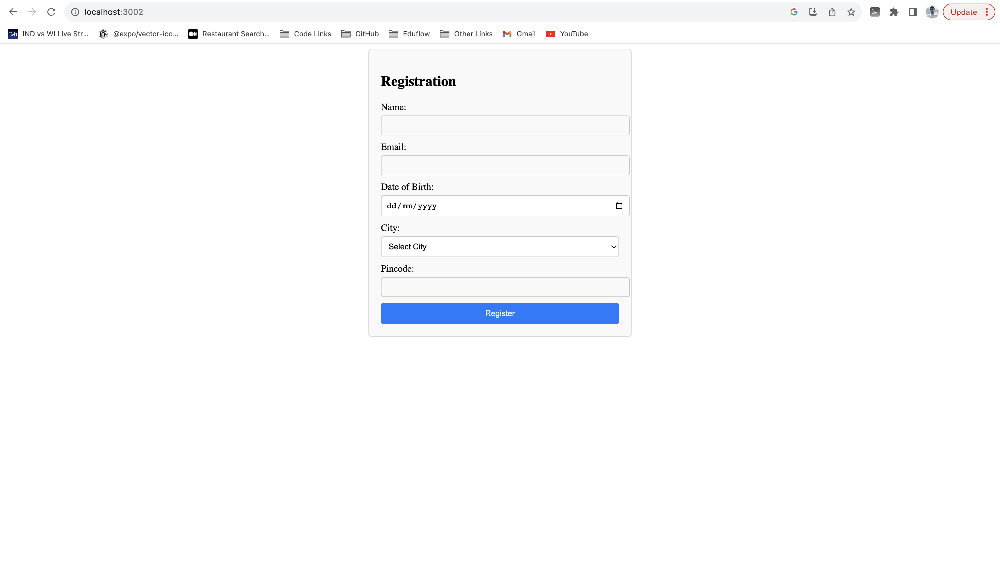

# User Registration App




This is a simple User Registration Application built using React, TypeScript. The application allows users to register by providing their name, email, date of birth, city, and pincode. It also includes a user list feature and basic error handling.

## Features

-User registration with validation:
-Apply searching by name in users-list.
-Proper validation and error handling with error messages and popups in the UI.

## Getting Started

### Prerequisites

Before you begin, ensure you have met the following requirements:

- Node.js: Make sure you have Node.js installed on your system. You can download it from [https://nodejs.org/](https://nodejs.org/).

### Installation

1. Clone the repository:

   ```bash
   git clone https://github.com/baliramgpt/ITNow_assignments
   cd ITNow_assignments/user-registration
   npm install
   npm start
