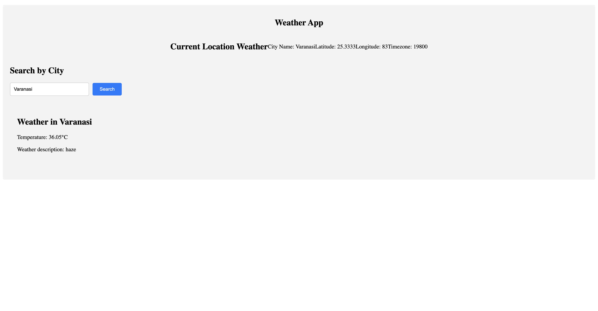

# Weather App



Weather App is a web application that allows users to check the weather details for their current location or search for weather information in a specific city. It utilizes the OpenWeatherMap API to provide real-time weather data.

## Features

- View weather details for the current location, including city name, latitude, longitude, timezone, and more.
- Search for weather details in a specific city by entering the city name.
- Error handling and display of error messages in case of API request failures.
- User-friendly UI for easy interaction.

## Getting Started

### Prerequisites

Before you begin, ensure you have met the following requirements:

- Node.js: Make sure you have Node.js installed on your system. You can download it from [https://nodejs.org/](https://nodejs.org/).

### Installation

1. Clone the repository:

   ```bash
   git clone https://github.com/baliramgpt/ITNow_assignments
   cd ITNow_assignments/weather-app
   npm install
   npm start
